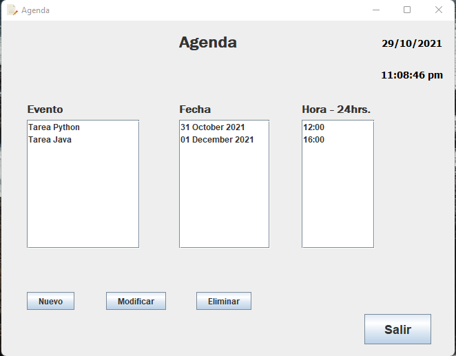
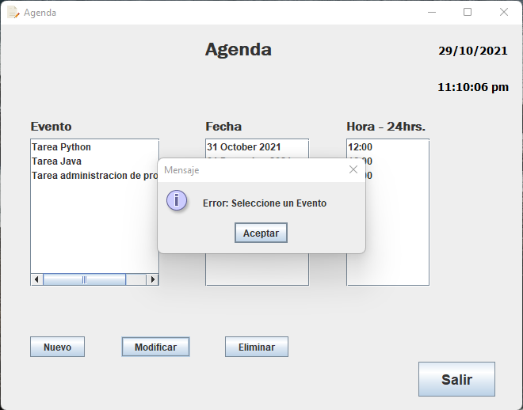
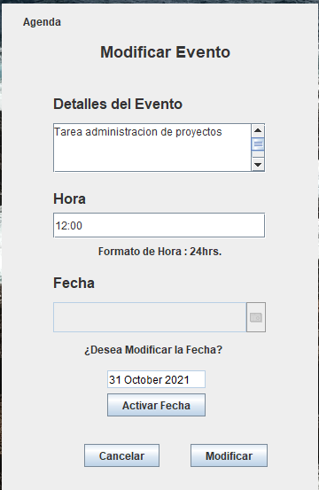
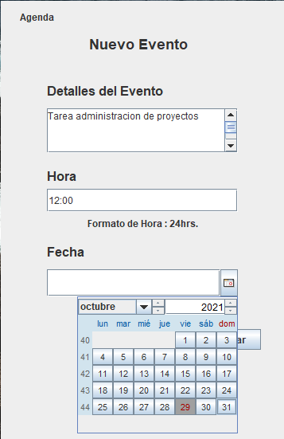
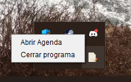

# ProyectoAgendaJava
En este Proyecto se desarrollo una agenda, utilizando Api
de colecciones, Entradas y Salidas (Archivos de texto) y una interfaz
gráfica con Swing/AWT.
En esta agenda se puede agregar el pendiente del usuario con su
respectiva fecha, el cual se podrá editar y borrar, se guardan los
datos(pendiente-fecha) en un archivo de texto, al iniciar el programa se
cargan los datos del archivo en una estructura de una API de
colecciones para poder tener mejor manejo de los datos.
## Imágenes de la Agenda
### Interfaz de la agenda

### Es necesarion seleccionar un evento para poder agregar, eliminar o modificar un evento

### Interfaz para moficacion un evento

### Interfaz para agregar un evento

### Al dar click en el boton "salir" se cierra la aplicacion, de otra manera quedara en segundo plano

